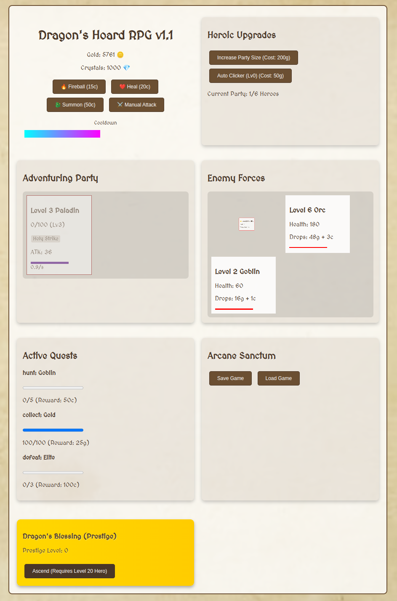

# LoopForge

This project demonstrates an AI-powered development workflow where:
- **Only GPTDiff** (via CLI tool) can write and modify code
[gptdiff](https://gptdiff.255labs.xyz)

## Core Rules
1. All code changes must be generated by `gptdiff`
2. The AI agent handles:
   - Feature implementation
   - Bug fixes
   - Error resolution
3. Bugs are described through stacktrace only and fixed with gptdiff.

## Workflow

```bash
while true; do
    gptdiff "make the game a fantasy themed incremental rpg with a ui in index.html. Make the aspects that are there more fun. Add aspects that are missing. Make the game playable. Prioritize the bugs" --apply
done
```

## Goal
See how well AI agent loops work on creating software from scratch with a fun game example.

## deepseek-r1


